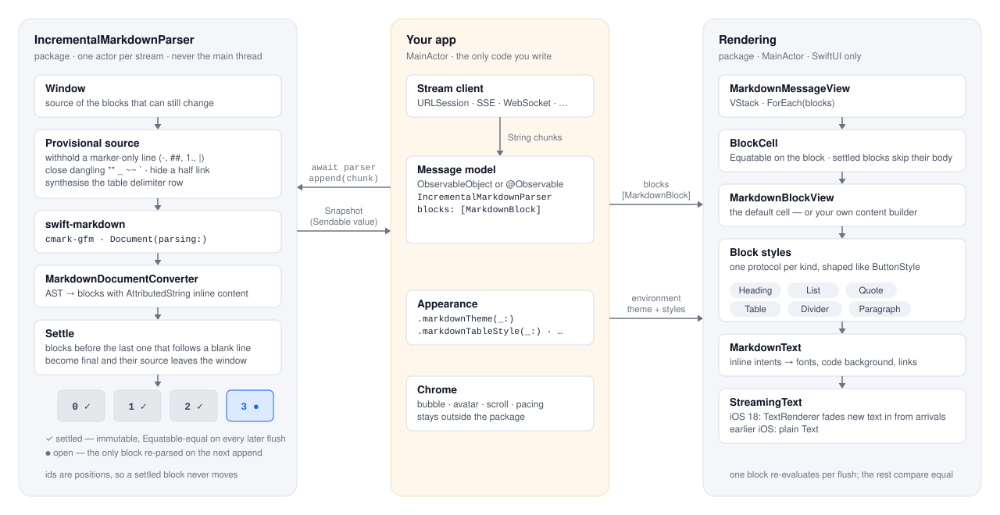

# MarkdownRenderer

A SwiftUI markdown renderer for text that arrives one token at a time.

Feed it chunks as they stream from an LLM and they render as they land: bold words arrive already bold, a half-typed link never shows its URL, a table is a table from its first header cell, and only the block still being written is ever re-parsed or re-drawn.


## Features

- Headings, paragraphs, lists (bullet, numbered, task, nested), block quotes, GFM tables, dividers. Fenced code and raw HTML are shown as plain text rather than dropped; there is no code highlighter.
- Half-arrived syntax is repaired before parsing, so `**bo` never flashes as asterisks and `| a | b` never sits on screen as a paragraph of pipes. Every repair can be switched off.
- Windowed parsing: each chunk re-parses only the block still being written, so cost grows with the response, not with its square.
- Settled blocks are `Equatable` values with positional ids; SwiftUI skips their bodies on every later flush.
- New text fades in through a `TextRenderer` on iOS 18; plain `Text` below. A block that stops being the last one finishes its fade instead of snapping.
- One actor per stream, so parsing never touches the main thread and several streams parse in parallel. The same state machine is available as a synchronous value type.
- Three layers of customisation: a theme, a style per block kind, and a per-block view builder.
- VoiceOver: headings are headers with their level, decorative bullets and rules are hidden, task boxes say whether they are done.
- One dependency: [swift-markdown](https://github.com/swiftlang/swift-markdown) (cmark-gfm).

## Installation

```swift
dependencies: [
    .package(url: "https://github.com/muradtries/MarkdownRenderer.git", from: "0.1.0"),
],
targets: [
    .target(name: "MyApp", dependencies: ["MarkdownRenderer"]),
]
```

Or in Xcode: **File ▸ Add Package Dependencies…** and paste the URL.

## Quick start

**Streaming.** One parser per message; `append` each chunk, `finish` when the stream ends, hand the snapshot's blocks to the view.

```swift
import MarkdownRenderer

@MainActor
final class Message: ObservableObject {
    @Published private(set) var blocks: [MarkdownBlock] = []
    private let parser = IncrementalMarkdownParser()

    func receive(_ chunk: String) async {
        blocks = await parser.append(chunk).blocks
    }

    func streamEnded() async {
        blocks = await parser.finish().blocks
    }
}

struct MessageView: View {
    @ObservedObject var message: Message

    var body: some View {
        MarkdownMessageView(blocks: message.blocks)
    }
}
```

**Already complete** (history, previews). The string is parsed once and again only when it changes, not on every update of the parent:

```swift
MarkdownMessageView(markdown: "# Done\n\nNothing to stream here.")
```

## How it works

<picture>
  <source media="(prefers-color-scheme: dark)" srcset="Docs/architecture-dark.svg">
  
</picture>

1. The parser keeps a **window**: the source of the blocks that can still change.
2. Before each parse the end of the window is made **provisional**: a marker-only line (`-`, `##`, `1.`, `|`, `- [ ]`) is withheld, dangling `**` `_` `~~` `` ` `` are closed, a half-arrived link is reduced to its label, and a table gets its delimiter row synthesised from the header. Nothing inside an open code fence is touched.
3. swift-markdown parses the window; the converter turns the AST into `MarkdownBlock`s whose inline content is already an `AttributedString`.
4. Every block before the last one that starts after a blank line is **settled**: it becomes final, keeps its **positional id**, and its source leaves the window. A block that was #7 last flush is #7 this flush, so view identity, `@State` and text selection survive.
5. The open blocks get **arrivals** — when each stretch of their text landed — for the fade-in.
6. `append` returns a `Snapshot` (`blocks`, `rawText`, `metrics`): one actor hop per flush.
7. `MarkdownMessageView` compares each block before drawing it, so only the block being written runs its body.

The pipeline, the rules it keeps and where each piece lives are described for contributors in [CONTRIBUTING.md](CONTRIBUTING.md).

### What is fixed while streaming

| Raw tail | Rendered as | Why |
|---|---|---|
| `the **import` | **import** | closers appended in nesting order; intraword `_` and code spans are respected |
| `see [the docs](https://ap` | see the docs | a link is its label until `)` arrives |
| `…\n-` or `…\n1` or `- [x` | *(nothing yet)* | a lone marker would flash as a paragraph, then turn into something else |
| `\| Technique \| Fix` | a 2-column table | GFM needs the delimiter row; it is synthesised from the header |
| ```` ```\na ** b ```` | `a ** b` | fences are literal: no repair, no settling on blank lines inside |

Repairs apply only while streaming; `finish()` parses the rest of the source as written. Each one can be turned off:

```swift
var options = MarkdownStreamingOptions()
options.repairs.remove(.hideIncompleteLinks)
let parser = IncrementalMarkdownParser(options: options)
```

`MarkdownStreamingOptions` also switches arrival tracking off (`tracksArrivals`) for apps that never fade text in, and takes the clock arrivals are stamped with, so tests can be deterministic.

## Customisation

Three layers, all environment-driven, so a chat bubble and a full-width document in the same app can differ.

**1. Theme — values.** Fonts, spacing, colours, motion:

```swift
var theme = MarkdownTheme()
theme.bodyFont = .callout
theme.blockSpacing = 10
theme.tableCornerRadius = 6
theme.fadeInDuration = 0.3

content.markdownTheme(theme)
```

Bold, italic, inline code and strikethrough take their size and weight from the surrounding font, so `` `code` `` in a heading is heading-sized.

**2. Block styles — layout of one kind.** One protocol per block kind, shaped like `ButtonStyle`: the configuration hands you the inline content as a ready-made `label` view plus the model and the theme in effect.

```swift
struct CardQuoteStyle: MarkdownQuoteStyle {
    func makeBody(configuration: Configuration) -> some View {
        configuration.label
            .padding(12)
            .background(.quaternary, in: RoundedRectangle(cornerRadius: 8))
    }
}

content.markdownQuoteStyle(CardQuoteStyle())
```

Available: `markdownHeadingStyle`, `markdownParagraphStyle`, `markdownListStyle`, `markdownQuoteStyle`, `markdownTableStyle`, `markdownDividerStyle`. The default table style has a footer slot for your own controls:

```swift
.markdownTableStyle(DefaultMarkdownTableStyle { configuration in
    Button("Export CSV") { export(configuration.table) }
})
```

**3. Content builder — any view per block.** Fall back to `MarkdownBlockView` for the kinds you do not draw yourself; use `MarkdownText(_:arrivals:)` to keep inline styling and the fade-in.

```swift
MarkdownMessageView(blocks: blocks) { block in
    switch block.kind {
    case .quote(let text):
        PullQuoteView(text: text, arrivals: block.arrivals)
    default:
        MarkdownBlockView(block: block)
    }
}
```

The builder runs only when a block changes, so state it captures must be read inside the returned view (`@Environment`, `@Binding`), not in the closure body — the same rule as a table view cell.

**Links** open through SwiftUI's `openURL` environment, so an app decides what a tap does:

```swift
content.environment(\.openURL, OpenURLAction { url in
    router.open(url)
    return .handled
})
```

## Threading

- `IncrementalMarkdownParser` is an actor. Create it anywhere; `append`, `finish` and `reset` are `await`ed. Each parser is its own actor, so two streams never wait for each other.
- `IncrementalParseState` is the same state machine as a synchronous, `Sendable` value. Use it to parse inside your own actor, in tests, or anywhere a hop is unwanted.
- `IncrementalMarkdownParser.blocks(parsing:)` parses a finished document in one pass on the caller's thread.
- Everything the views receive (`MarkdownBlock`, `AttributedString`, `TextArrival`, `ParseMetrics`) is `Sendable`; swift-markdown's `Document` never leaves the parser.
- Appends are applied in the order they reach the actor. Feed one stream from one task.

## Performance

Measured in Release on an iPhone 18 Pro simulator with the opt-in benchmarks in `Tests/MarkdownRendererTests/Benchmarks`:

| Workload | Cost |
|---|---|
| A 6.6 KB reply streamed as 1,655 tokens | 55–80 ms of parsing in total, 35–50 µs per token |
| One flush of a 10 KB open block: scan + repairs | ~130 µs |
| Same flush: cmark + conversion to blocks | up to ~9 ms for dense inline markup or a 300-row table |

The cost of a flush follows the size of the block being written, not of the response. The worst case is therefore one very large block — a 300-row table or a single 20 KB paragraph — which is re-parsed whole on every chunk. If your content has those, coalesce chunks to one flush per display frame before appending; everything else is handled for you.

On the view side, keep long transcripts in a `LazyVStack` so off-screen messages release their text, and consider `theme.isTextSelectable = false` where selection is not needed: selection costs memory per text view.

## Metrics

`Snapshot.metrics` / `parser.metrics`:

| Field | Meaning |
|---|---|
| `parseCount` | parses so far |
| `charactersScanned` | source handed to cmark, summed; linear with windowing |
| `parseDuration`, `averageParseMilliseconds` | time spent re-parsing: scan, repairs, cmark and conversion |
| `blockCount` | blocks so far |

## Contributing

See [CONTRIBUTING.md](CONTRIBUTING.md) for the architecture, the invariants the parser keeps, how to add a block kind or a repair, and how the tests are organised.

## License

MIT — see [LICENSE](LICENSE).
